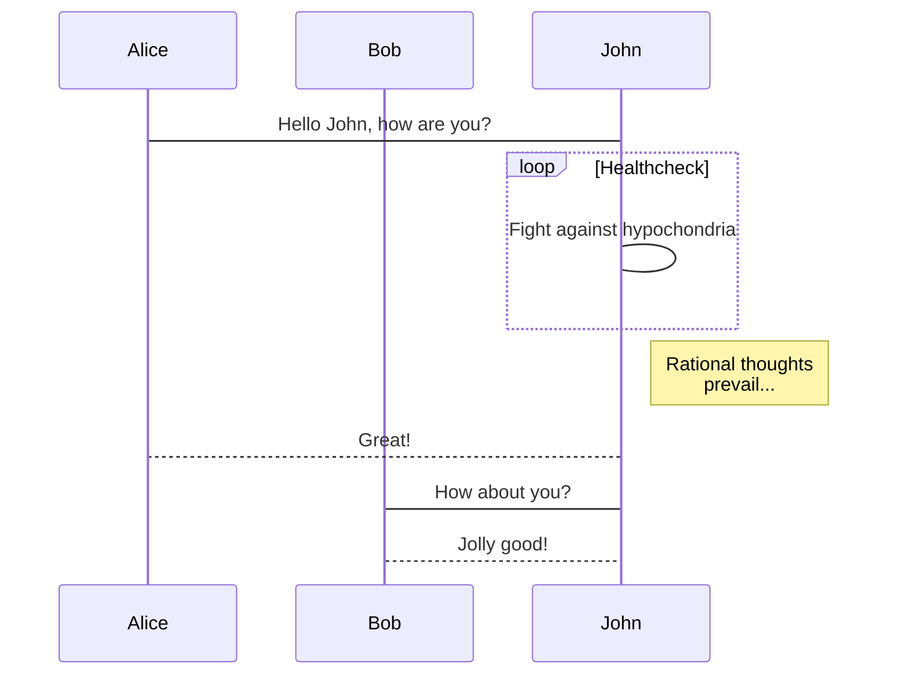

# BookList

数据结构与算法分析Java语言描述

## table

```plain_text


```
## table 2


```plain_text
```echarts
option = {
    xAxis: {
        type: 'category',
        data: ['Mon', 'Tue', 'Wed', 'Thu', 'Fri', 'Sat', 'Sun']
    },
    yAxis: {
        type: 'value'
    },
    series: [{
        data: [820, 932, 901, 934, 1290, 1330, 1320],
        type: 'line'
    }]
};
```

```
- [ ] <mark>100</mark><sup>2</sup>
1. vega-lite
12,23,
```
