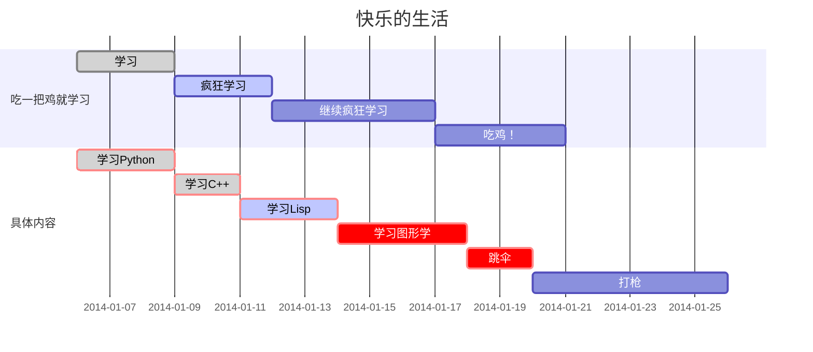

## [Block Elements](https://support.typora.io/Markdown-Reference/#block-elements)

### 标题

标题`#`在行首使用 1-6 个哈希 ( ) 字符，对应于标题级别 1-6。例如：

```
# This is an H1

## This is an H2

###### This is an H6
```

### 引用

Markdown 使用电子邮件样式 > 字符来进行块引用。它们呈现为：

```
> This is a blockquote with two paragraphs. This is first paragraph.
>
> This is second paragraph. Vestibulum enim wisi, viverra nec, fringilla in, laoreet vitae, risus.

> This is another blockquote with one paragraph. There is three empty line to separate two blockquotes.
```

### 列表

键入`* list item 1`将创建一个无序列表。（`*`符号可以替换为`+`或`-`。）

键入`1. list item 1`将创建一个有序列表。

例如：

```
## un-ordered list
*   Red
*   Green
*   Blue

## ordered list
1.  Red
2.     Green
3.    Blue
```

### 任务列表(Checkbox)

任务列表是带有标记为 [ ] 或 [x]（不完整或完整）的项目的列表。例如：

```
- [ ] a task list item
- [ ] list syntax required
- [ ] normal **formatting**, @mentions, #1234 refs
- [ ] incomplete
- [x] completed
```

### Code

Typora 仅支持 GitHub Flavored Markdown 中的栅栏，不支持原始代码块样式。

使用围栏很容易：输入` ``` ` 并按`return`。在` ``` `后面添加一个可选的语言标识符，Typora 通过语法高亮来运行它：


```python
function test() {
  console.log("notice the blank line before this function?");
}
```

语法高亮:

```ruby
require 'redcarpet'
markdown = Redcarpet.new("Hello World!")
puts markdown.to_html
```
### Table

| First Header | Second Header    |
| ------------ | ---------------- |
| Content Cell | Content Cell     |
| Content Cell | **Content Cell** |
```

还可以在表格中包含内联 Markdown，例如链接、粗体、斜体或删除线。

通过`:`在标题行中包含冒号 ( )，您可以将该列中的文本设置为左对齐、右对齐或居中对齐：

```
| Left-Aligned  | Center Aligned  | Right Aligned |
| :------------ |:---------------:| -----:|
| col 3 is      | some wordy text | $1600 |
| col 2 is      | centered        |   $12 |
| zebra stripes | are neat        |    $1 |


### footnotes

一般把脚注`[^内容]`放到文章末尾

You can create footnotes like this[^fn1] and this[^fn2].

[^fn1]: Here is the *text* of the first **footnote**.
[^fn2]: Here is the *text* of the second **footnote**.


### 横线

```
***
---
```


## Span Elements

### 下标

要使用此功能，首先，请在 `偏好设置` 面板 -> `Markdown扩展语法` 选项卡中启用它。然后用 `~` 来包裹下标内容，例如： `H~2~O`, `X~long\ text~`/

### 上标

要使用此功能，首先，请在 `偏好设置` 面板 -> `Markdown扩展语法` 选项卡中启用它。然后用 `^` 来包裹上标内容，例如： `X^2^`。

### 高亮

要使用此功能，首先，请在 `偏好设置` 面板 -> `Markdown扩展语法` 选项卡中启用它。然后用 `==` 来包裹高亮内容，例如： `==highlight==`。

### 链接

This is [an example](http://example.com/ "Title") inline link. [This link](http://example.net/) has no title attribute.

#### Inline link

This is [an example](http://example.com/ "Title") inline link.

This is [an example](http://example.com/ "Title") inline link.

[This link](http://example.net/) has no title attribute.


#### Internal link

只能跳转到标题

Hold down Cmd (on Windows: Ctrl) 
click on [this link](#block-elements) to jump to header `Block Elements`. 

```
like [this](#Internal link)
```


#### Reference Links

This is [an example][id] reference-style link.

一般把 id 放到文章末尾


This is [an example][id] reference-style link.

Then, anywhere in the document, you define your link label on a line by itself like this:

[id]: http://example.com/  "Optional Title Here"
```
[id]: http://example.com/    "Optional Title Here"
```


### Picture

图片在


## 图


### 流程图


```
st=>start: Start:>http://www.google.com[blank] 
e=>end:>http://www.google.com 
op1=>operation: My Operation 
sub1=>subroutine: My Subroutine 
cond=>condition: Yes or No?:>http://www.google.com
io=>inputoutput: catch something...
para=>parallel: parallel tasks 
st->op1->cond 
cond(yes)->io->e 
cond(no)->para 
para(path1, bottom)->sub1(right)->op1 
para(path2, top)->op1
```


```flow
st=>start: Start:>http://www.google.com[blank] 
e=>end:>http://www.google.com 
op1=>operation: My Operation 
sub1=>subroutine: My Subroutine 
cond=>condition: Yes or No?:>http://www.google.com
io=>inputoutput: catch something...
para=>parallel: parallel tasks 
st->op1->cond 
cond(yes)->io->e 
cond(no)->para 
para(path1, bottom)->sub1(right)->op1 
para(path2, top)->op1

```


### 序列图


````
```sequence
Title: Here is a title 
A->B: Normal line 
B-->C: Dashed line 
C->>D: Open arrow 
D-->>A: Dashed open arrow
```
````


```sequence
Title: Here is a title 
A->B: Normal line 
B-->C: Dashed line 
C->>D: Open arrow 
D-->>A: Dashed open arrow
```


### mermaid图


```
gantt
        dateFormat  YYYY-MM-DD
        title 快乐的生活
        section 吃一把鸡就学习
        学习:done,des1, 2014-01-06,2014-01-09
        疯狂学习:active,des2, 2014-01-09, 3d
        继续疯狂学习:des3, after des2, 5d
        吃鸡！:des4, after des3, 4d
        section 具体内容
        学习Python: crit, done, 2014-01-06,72h
        学习C++: crit, done, after des1, 2d
        学习Lisp: crit, active, 3d
        学习图形学: crit, 4d
        跳伞: crit,2d
        打枪: 6d
```




