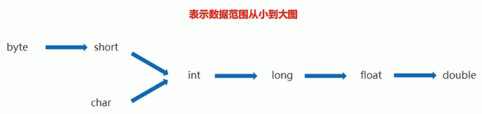

# Java基础


- [Java基础](#java基础)
  - [基础](#基础)
    - [JDK下载](#jdk下载)
    - [IDEA](#idea)
    - [注释](#注释)
    - [数据类型](#数据类型)
      - [整数](#整数)
      - [浮点数](#浮点数)
      - [其他](#其他)
      - [运算符](#运算符)
      - [自加/自减](#自加自减)
      - [三元运算符](#三元运算符)
    - [数据输入](#数据输入)
    - [分支结构](#分支结构)
      - [Switch](#switch)
      - [if-else](#if-else)
    - [循环结构](#循环结构)
      - [while](#while)
      - [for](#for)
      - [do-while](#do-while)
    - [方法](#方法)
    - [内存分配](#内存分配)
  - [面向对象](#面向对象)
    - [封装](#封装)
      - [单例设计模式](#单例设计模式)
    - [继承](#继承)

## 基础

### JDK下载

Oracle 账号
1602404824@qq.com
密码：wf1996ROOT#

JDK 下载地址： 
- https://www.azul.com/downloads/?version=java-11-lts&os=macos&architecture=arm-64-bit&package=jdk#download-openjdk
- https://www.oracle.com/java/technologies/downloads/
- https://www.oracle.com/java/technologies/javase/jdk16-archive-downloads.html

MAC 下JDK位置为 `/Library/Java/JavaVirtualMachines`

在`.bashrc`中
```shell
# JAVA
export JAVA_8_HOME=$(/usr/libexec/java_home -v 1.8)
alias jdk8='export JAVA_HOME=$JAVA_8_HOME'

export JAVA_11_HOME=$(/usr/libexec/java_home -v 11)
alias jdk11='export JAVA_HOME=$JAVA_11_HOME'

export JAVA_16_HOME=$(/usr/libexec/java_home -v 16)
# JAVA_16_HOME=/Library/Java/JavaVirtualMachines/jdk-16.0.2.jdk/Contents/Home
alias jdk16='export JAVA_HOME=$JAVA_16_HOME'
# 默认使用jdk11
export JAVA_HOME=$JAVA_11_HOME
#java END
```

### IDEA

下载地址 https://www.jetbrains.com/zh-cn/idea/download/

**新Project流程**
File > New > New Project > Empty Project > Next > Name and Location > Finish > Module > Package > Class
Project 项目 > Module 模块 > Package 包 > Class 类

**主题设置**
File > Settings > Appearance > Theme 

**字体设置**
File > Settings > Editor > Font 

**快捷键**
- Command + Option + L 格式化代码
- Control + Option + O 优化import
- Command + D 复制当前行或选定的块
- Command + Delete 删除当前行或选定的块的行
- Option + Enter 创建方法
- Command + ctrl + G ：选中所有相同的内容
- Command + option + t 包含代码块
- Command + N: 生成代码
- Shift + option + ⬆/⬇: 上下移动代码行 


### 注释

单行注释：`//`
多行注释：`/*注释信息*/`
文档注释：
```java
/**
 * @author 作者
 * @param shopCar
 * @return 返回值
 * @throws NullPointerException 可能引发的异常
 */
```

### 数据类型

#### 整数
bit（位） byte（字节）
	- byte： 1字节 -128～127
	- short：2字节 -32768～32767
	- int：4字节 -2的31次方到2的31次方-1
	- long：8字节 -2的63次方到2的63次方-1
#### 浮点数
	- float 4字节
	- double 8字节
#### 其他
	- char 2字节
	- boolean


#### 运算符

#### 自加/自减
```java
int i = 1;
System.out.println(++i); // 2
System.out.println(i++); // 2
System.out.println(i); // 3
```

#### 三元运算符
格式：关系表达式？表达式1:表达式2
示例：`a > b ? a : b`
```java
public class N {
    public static void main(String[] args) {
        int[] s = {1,2,3,4};
        print(s);
    }
	// 示例输出 [1,2,3,4], 判断是否是最后一位，如果不是最后一位则在输出后加一个逗号
    public static void print(int[] s) {
        System.out.print('[');
        if (s != null && s.length > 0){       
            for (int i = 0; i < s.length; i++) {
                System.out.print(i == s.length - 1 ? s[i] : s[i] + ", ");
            }
        }
        System.out.println(']');
    }
}

```
### 数据输入
```java
import java.util.Scanner;
Scanner sc = new Scanner(System.in);
int i = sc.nextInt();
```


### 分支结构
#### Switch
```java
//可以使用 int char string
switch (ch) { 
	case 1:
		System.out.println(1);
		break;
	case 2:
		System.out.println(2);
		break;
	default:
		System.out.println(4);
		break;
```

#### if-else
```java
if (score < 0 && score > 100) {
    System.out.println("分数错误");
} else if (score < 60 ) {
    System.out.println("不及格");
} else {
    System.out.println("及格了");
}
```

### 循环结构
#### while
```java
while (i < 100) {
	i++;
	System.out.println(i);
}
```

#### for
```java
// i小于100则输出
for (int i = 0; i < 100; i++) {
    System.out.println(i); 
}
```

#### do-while
```java
int i = 0;
do {
    i++;
    System.out.println(i); //输出101
} while (i <= 100);

```

### 方法
```java
public class N {
    public static void main(String[] args) {
        int a = 10; // a和b是实参
        int b = 15;
		int c = sum(a, b); // 值传递
        System.out.println(c); 
        int[] s = {1,1,1,1};
        change(s); // 引用传递
        for (int i = 0; i < s.length; i++) {
            System.out.println(s[i]);
        }
    }
    public static int sum(int a, int b) { // a 和 b是形参
        int c = a + b;
        return c;
    }
    public static void change(int[] s) {
        s[1] = 0;
    }
}

```

### 内存分配

- 方法区: 将Class以及方法加载到方法区
- 栈内存: 将方法和变量加载到栈内存中，方法运行完毕就会退出栈内存,栈内存：方法，变量
- 堆内存：new 对象


## 面向对象

### 封装

利用抽象数据类型将数据和基于数据的操作封装在一起，使其构成一个不可分割的独立实体。数据被保护在抽象数据类型的内部，尽可能地隐藏内部的细节，只保留一些对外接口使之与外部发生联系。用户无需知道对象内部的细节，但可以通过对象对外提供的接口来访问该对象。

好处:
- 可以在不影响调用的情况下修改内部代码
- 可以对数据进行校验（严格控制数据输入）


**Static**

Static方法可以访问Static成员变量

成员方法可以访问Static成员变量

Static中不能包含`this`关键字

静态代码块
- static {} 与类一起加载，自动触发，加载且仅加载一次
- 用于初始化静态资源
实例代码块(构造代码块)
- {} 每次创建实例时,在构造器之前被加载
- 用于初始化实例资源

```java
public class Car {
    // 类在第一次被加载的时候执行
    static {
        System.out.println("====静态代码块被执行====");
    }
    // 实例代码块，每次创建实例时先于构造器执行
    {
        System.out.println("====实例代码块被执行====")；
    }
}
```

#### 单例设计模式
单例设计模式，构造器私有（private）可以保证这个类只有一个实例 

- 饿汉单例（提前准备好实例）

    ```java
    public class HungerSingleInstance {
        //static 变量与类一同加载，且仅有一个
        public static HungerSingleInstance instance = new HungerSingleInstance();
        private HungerSingleInstance(){
            System.out.println("创建了一个对象");
        }

        public static void main(String[] args) {
            //s1 和 s2相等，SingleInstance.instance 有且仅有一个
            HungerSingleInstance s1 = HungerSingleInstance.instance;
            HungerSingleInstance s2 = HungerSingleInstance.instance;
        }
    }
    ```

- 懒汉单例（需要实例时调用`getInstance`获取对象）

    ```java
    public class SingleInstance {
      	//使用private 更安全，防止空对象
        private static SingleInstance instance;
        private SingleInstance(){}
        public static SingleInstance getInstance() {
            if (instance == null) {
                instance = new SingleInstance();
            }
            return instance;
        }
    }
    ```

    

### 继承

```jav	
public class Student extends People()
```

