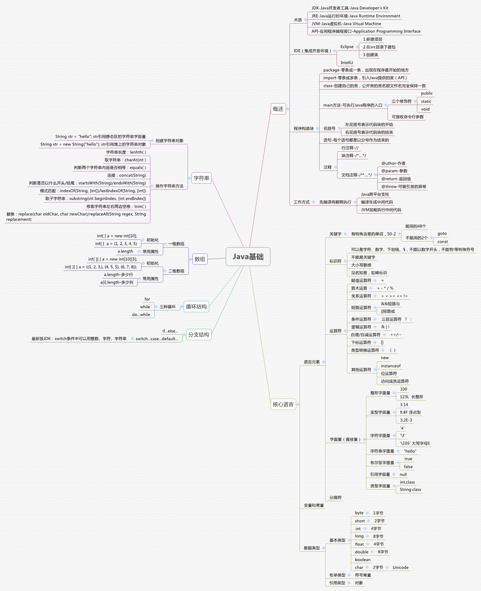

# Java基础
#Work/java
### JDK
Oracle 账号
1602404824@qq.com
密码：wf1996ROOT#

JDK 下载地址： https://www.oracle.com/java/technologies/javase/jdk16-archive-downloads.html

MAC 下JDK位置为 `/Library/Java/JavaVirtualMachines`

在`.bashrc`中
```shell
# JAVA
export JAVA_8_HOME=$(/usr/libexec/java_home -v 1.8)
alias jdk8='export JAVA_HOME=$JAVA_8_HOME'

export JAVA_11_HOME=$(/usr/libexec/java_home -v 11)
alias jdk11='export JAVA_HOME=$JAVA_11_HOME'

export JAVA_16_HOME=$(/usr/libexec/java_home -v 16)
# JAVA_16_HOME=/Library/Java/JavaVirtualMachines/jdk-16.0.2.jdk/Contents/Home
alias jdk16='export JAVA_HOME=$JAVA_16_HOME'
# 默认使用jdk11
export JAVA_HOME=$JAVA_11_HOME
#java END
```

### IDEA
下载地址 https://www.jetbrains.com/zh-cn/idea/download/

**新Project流程**
File > New > New Project > Empty Project > Next > Name and Location > Finish > Module > Package > Class
Project 项目 > Module 模块 > Package 包 > Class 类

**主题设置**
File > Settings > Appearance > Theme 

**字体设置**
File > Settings > Editor > Font 

**快捷键**
Command + Option + L 格式化代码

Control + Option + O 优化import

Command + D 复制当前行或选定的块

Command + Delete 删除当前行或选定的块的行

Option + Enter 创建方法

Command + ctrl + G ：选中所有相同的内容

Command + option + t 包含代码块




### 注释

单行注释：`//`
多行注释：`/*注释信息*/`
文档注释：
```java
/**
 * @author 作者
 * @param shopCar
 * @return 返回值
 * @throws NullPointerException 可能引发的异常
 */
```

### 数据类型
#### 整数
bit（位） byte（字节）
	- byte： 1字节 -128～127
	- short：2字节 -32768～32767
	- int：4字节 -2的31次方到2的31次方-1
	- long：8字节 -2的63次方到2的63次方-1
#### 浮点数
	- float 4字节
	- double 8字节
#### 其他
	- char 2字节
	- boolean


### 运算符

#### 自加/自减
```java
int i = 1;
System.out.println(++i); // 2
System.out.println(i++); // 2
System.out.println(i); // 3
```

#### 三元运算符
格式：关系表达式？表达式1:表达式2
示例：`a > b ? a : b`
```java
public class N {
    public static void main(String[] args) {
        int[] s = {1,2,3,4};
        print(s);
    }
	  # 示例输出 [1,2,3,4], 判断是否是最后一位，如果不是最后一位则在输出后加一个逗号
    public static void print(int[] s) {
        System.out.print('[');
        if (s != null && s.length > 0){       
            for (int i = 0; i < s.length; i++) {
                System.out.print(i == s.length - 1 ? s[i] : s[i] + ", ");
            }
        }
        System.out.println(']');
    }
}

```
### 数据输入
```java
import java.util.Scanner;
Scanner sc = new Scanner(System.in);
int i = sc.nextInt();
```


### 分支结构
#### Switch
```java
//可以使用 int char string
switch (ch) { 
	case 1:
		System.out.println(1);
		break;
	case 2:
		System.out.println(2);
		break;
	default:
		System.out.println(4);
		break;
```

#### if-else
```java
if (score < 0 && score > 100) {
    System.out.println("分数错误");
} else if (score < 60 ) {
    System.out.println("不及格");
} else {
    System.out.println("及格了");
}
```

### 循环结构
#### while
```java
while (i < 100) {
	i++;
	System.out.println(i);
}
```

#### for
```java
// i小于100则输出
for (int i = 0; i < 100; i++) {
    System.out.println(i); 
}
```

#### do-while
```java
int i = 0;
do {
    i++;
    System.out.println(i); //输出101
} while (i <= 100);

```

### 方法
```java
public class N {
    public static void main(String[] args) {
        int a = 10; // a和b是实参
        int b = 15;
		  int c = sum(a, b); // 值传递
        System.out.println(c); 
        int[] s = {1,1,1,1};
        change(s); // 引用传递
        for (int i = 0; i < s.length; i++) {
            System.out.println(s[i]);
        }
    }
    public static int sum(int a, int b) { // a 和 b是形参
        int c = a + b;
        return c;
    }
    public static void change(int[] s) {
        s[1] = 0;
    }
}

```

### 内存分配

将Class以及方法加载到方法区

将方法和变量加载到栈内存中，方法运行完毕就会退出栈内存
栈内存：方法，变量

堆内存：new 对象

### String
以“” 方式给出的字符串对象，在字符串常量池中存储，且相同的内容只会保存一次。
通过构造器new对象，每次new都会产生新对象，放在堆内存中
`注意：字符串内容不适合用 '==' 因为其中存储的是地址`
```java
String s1 = "123";
String s2 = "123";
System.out.println(s1 == s2); // true

char[] chs = {'a','b','c'};
String s3 = new String(chs);
String s4 = new String(chs);
System.out.println(s3 == s4); //false
```

String 常用方法
```java
String a = "  abcdefghkjg  ";
String b = "abc";
a.length();  //获取字符串长度 15
a.toCharArray(); // 返回字符数组
a.charAt(2); //获取指定位置的字符 'a'
a.substring(2,5); //截取字符串包前不包后 abc 
a.split("c")[0]; // 通过指定字符切割字符串，返回字符串数组 '  ab'
a.equals(b); //判断字符串是否相等 false
a.equalsIgonreCase(b); //忽略大小写验证字符串是否相等（验证码）
a.concat(b); //链接2个字符串 '  abcdefghkjg  abc'
a.startsWith("abc",2); //判断指定位置是否以指定字符开头 true
a.endsWith("g  ") //判断是否以指定字符结尾 true
a.trim(); //去首尾空格 'abcdefghkjg'
a.replace("abc","123"); //字符串替换 '  123defghkjg  '
a.indexOf("g",9); // 返回指定字符串的所在位置 12
a.toUpperCase(); // 返回大写字符
a.toLowerCase(); // 返回小写字符
```

### 数组
```java
int[] sales = new int[]{10,20,30}; // 静态初始化
int[] a = new int[5]; // 动态初始化
int[] b = a; // 引用传递
a.toString() == b.toString() // true [I@3f0ee7cb

int[][] a = new int[5][5]; // 二维数组动态初始化
System.out.println(sales.length); // 3
System.out.println(a[1].length); // 5
```

### ArrayList
集合只能存储引用类型，不支持基本类型
```java
ArrayList<String> arr = new ArrayList<String>();
ArrayList<Integer> I = new ArrayList<>(); // 整数集合

arr.add("Google");
arr.add("Amazon");
arr.add("Baidu");
arr.add("Google");
arr.get(1); //获取指定位置的元素 Amazon
arr.set(2,"BMW"); // 修改下标为2的元素 返回修改前的元素
arr.remove(1); // 删除下标为1的元素 返回删除的元素
arr.remove("Google"); // 删除"Google"的元素，删除第一次出现的元素 返回true或者false
arr.size(); // 获取arr的长度

for (String i : arr) { //遍历arr
    System.out.println(i);
}
```
