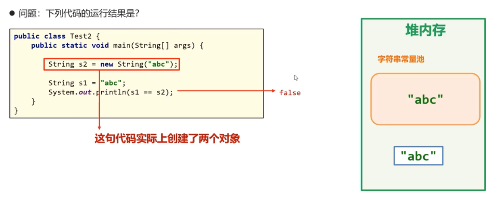

# 面试题




```java
String s1 = "abc";
String s2 = "a" + "b" + "c"; //编译优化机制会将 "a" + "b" + "c" 变为 "abc"
System.out.println(s1 == s2); // true

String s1 = "abc";
String s2 = "ab";
String s3 = s2 + "c"; // 编译阶段无法确定s2的值
System.out.println(s1 == s3); // false

```


单例设计模式，构造器私有（private）可以保证这个类只有一个实例 

- 饿汉单例（提前准备好实例）

  ```java
  public class SingleInstance {
    //static 变量与类一同加载，且仅有一个
    public static SingleInstance instance = new SingleInstance();
    private SingleInstance(){
      System.out.println('创建了一个对象')
    }
  }
  //s1 和 s2相等，SingleInstance.instance 有且仅有一个
  SingleInstance s1 = SingleInstance.instance;
  SingleInstance s2 = SingleInstance.instance;
  ```

- 懒汉单例（需要实例时调用`getInstance`获取对象）

  ```java
  public class SingleInstance {
    	//使用private 更安全，防止空对象
      private static SingleInstance instance;
      private SingleInstance(){}
      public static SingleInstance getInstance() {
          if (instance == null) {
              instance = new SingleInstance();
          }
          return instance;
      }
  }
  ```

  
